**Django** MY DJANGO BOOKLEET 

**AMIR MOHMMAD HOUSHMAND** 

DON'T REPEAT YOURSELF 

Telegram ID :[ https://t.me/Houshmand_Am ](https://t.me/Houshmand_Am)

**TOPICS**

[**01 Getting Started**](#_page1_x547.00_y18.92)

Why Django? What I learn in this course                                                                                                                                                            3 

[**02 COURSE SETUP**](#_page2_x15.00_y725.92)

How crate a Django project and setup VIRTUALENV                                                                                                                                 4 [**03 URLS & VIEWS**](#_page4_x363.00_y18.92)

How crate a simple page in Django with views and URL          5

[**04 TEMPLATES & STATIC FILES**](#_page8_x15.00_y18.92)

How render a html file and load static file and like this                                                                                                                                    9 

[**06 Data & Models** ](#_page18_x15.00_y18.92)

Database and models                                                                                                                                                                                                   19 

[**07 Admin** ](#_page29_x15.00_y18.92)

Administration and use feature of that                                                                                                                                                              30    

[**08 Relationships** ](#_page33_x15.00_y18.92)

Add relationships to models                                                                                                                                                                                 34 

[**10 Forms**](#_page39_x15.00_y18.92)

Form and unput the data of users like login and signup                                                                                                                                40 

[**11 Class Views**](#_page53_x15.00_y18.92)

About Class Views                                                                                                                                                                                                       54 

[**12 File Uploads**](#_page59_x15.00_y18.92)

About how upload the data in django                                                                                                                                                                    60 

[**13 Sessions**](#_page64_x15.00_y18.92)

what are sessions and how we can use it                                                                                                                                                                                               65  

[**14 Important notes**](#_page66_x15.00_y18.92)

A short section on what we can do after finishing the book                                                                                                                                                 67

3 
4**  

**GETTING STARTED **

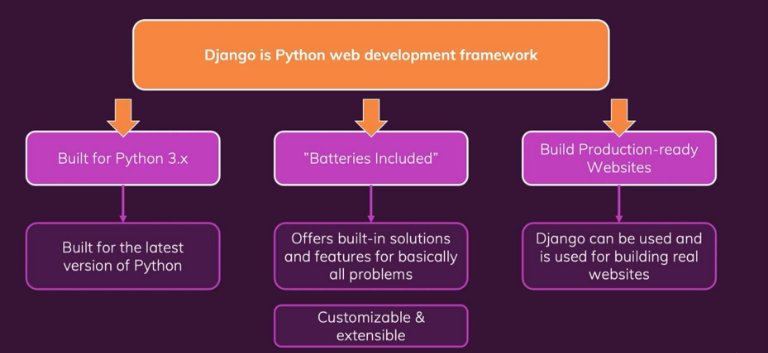

oo2

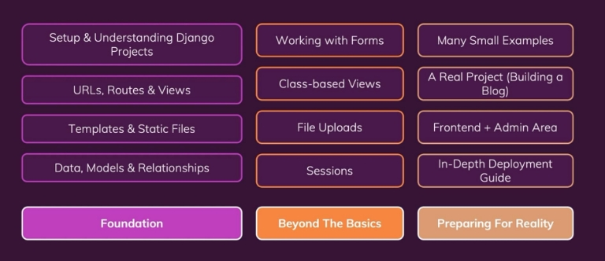

oo4 

All this part is sync by this course:                               https://www.udemy.com/course/python-django-the-practical-guide/ 

4 
5** 

**COURSE SETUP **

For create a venv: 

pip install virtualenv

virtualenv -p python3 venv  

Now active the venv: .\venv\Scripts\activate 

And then install Django: 

pip install django 

Create Django project: 

django-admin startproject hash\_neco Run the Django project: 

python manage.py runserver 

Now go to browser and type this: http://127.0.0.1:8000/ 

Or: 

localhost:8000 

For create app in Django: 

python manage.py startapp NameOfApp 

5 

https://github.com/houshmand-2005/hash\_neco/tree/setup\_002 

03

**URLS & VIEWS **

**oo4** 

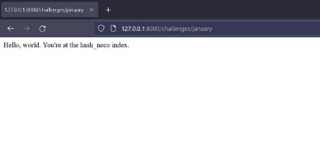

For show this page we must config URLs and views 

In our app(challenges) views we must add some function so I create a function named index you can named this function everything you want! 

hash\_neco\challenges\views.py 

def index(request): 

`    `return HttpResponse("Hello, world. You're at the hash\_neco index.") 

but for Django understand what is HttpResponse we need import this 

from django.http import HttpResponse

this **function** needs a URL to Know where this message shows up! So in our app we create an urls.py in this file we need import our views file and an urlpatterns to add our URLs for add an URL we need import path from Django URLs. hash\_neco\challenges\urls.py 

from django.urls import path from . import views 

urlpatterns = [ 

`    `path("january", views.index, name="january"), ] 

Path(“here we put the URL”, here the view we want for the URL we add, and here we give this URL a name for some usage), 

But Django doesn’t know we add some URL so in main folder(hash\_neco) urls.py we add some path for add our paths in our app but for doing this we need import include from Django URLs  

hash\_neco\hash\_neco\urls.py 

from django.contrib import admin from django.urls import path, include

urlpatterns = [ 

`    `path('admin/', admin.site.urls), 

`    `path("challenges/", include("challenges.urls")), ] 

**oo6** 

Now if we want to add the other month, we most use Dynamic Path to don’t hard work so for this we add a new URL 

6 

hash\_neco\challenges\urls.py 

urlpatterns = [ 

`    `path("<month>", views.month\_index, name="month\_index"), ] 

Path(“here we need a parameter for month so in django we most put  parameter in <> (Dynamic Segments)”, views, name) So, in views we add a **function** 

hash\_neco\challenges\views.py 

def month\_index(request, month): 

`    `if month == "january": 

`        `challenge\_text = "this is january challenge:)"     elif month == "february": 

`        `challenge\_text = "this is february challenge:)"     elif month == "march": 

`        `challenge\_text = "this is march challenge:)"

`    `return HttpResponse(challenge\_text) 

in the second parameter we most add the parameter in URL so when we type something the text goes in month and then if the text It was equal to one of month, then the challenge\_text is the text and then Django render this page. 

But if user input number or something else we most handle this with HttpResponseNotFound like this (this text is in function): 

else: 

`        `return HttpResponseNotFound("<h1>404</h1>") 

So, if I input:                                                                                                      This is output: http://127.0.0.1:8000/challenges/january       ➔     this is january challenge http://127.0.0.1:8000/challenges/february      ➔     this is february challenge http://127.0.0.1:8000/challenges/march         ➔     this is march challenge http://127.0.0.1:8000/challenges/somethingelse ➔     404 

**oo7** 

But if we want user give us a number and we see what the month is and then render the month we most give another parameter (Dynamic 

Segments) like <int:month> and   <str:month> so if we input num it can be go on anther view like : hash\_neco\challenges\urls.py 

urlpatterns = [ 

path("<int:month>", views.month\_index\_bynumber, name="month\_index"),   path("<str:month>", views.month\_index, name="month\_index"),  

] 

**oo8** 

Let’s back to our app for better code in views we can made a dictionary for month like this : hash\_neco\challenges\views.py 

month\_challenge = { 

`    `"january": "this is january challenge:)", 

`    `"february": "this is february challenge:)",     "march": "this is march challenge:)", 

...

} 

And then in function: 

def month\_index(request, month): 

`    `try: 

`        `challenge\_text = month\_challenge[month] 

`        `return HttpResponse(challenge\_text) 

`    `except: 

`        `return HttpResponseNotFound("<h1>404</h1>") 

Then we user try and except for if user input something else show 404 error 

**oo9** 

Now we want to add if user type number of month Django redirect to month for redirect we need import HttpResponseRedirect from django http 

from django.http import HttpResponse, HttpResponseNotFound, HttpResponseRedirect

And then in function: 

def month\_index\_bynumber(request, month): 

`    `months = list(month\_challenge.keys()) 

`    `if month > len(months): 

`        `return HttpResponseNotFound("<h1>404</h1>") 

`    `forward\_month = months[month - 1] 

`    `return HttpResponseRedirect(f"/challenges/{forward\_month}") 

First, we get month number then we list the dictionary keys this is output: 

['january', 'february', 'march'] 

And then if number is bigger than len(months) return 404 error but if is smaller we do this 

forward\_month = months[month - 1] 

we do this because lists start at 0. then we redirect user to moth. 

**o10** 

One of other thing we hard coded is redirect path Why? 

Because if we change the main URL  (path("challenges/",  include("challenges.urls")),) our redirect method doesn’t work Because we hard code so for right way we must name "<str:month>" URL  like name="month\_index"  

than we import reverse from django URLs in views.py 

from django.urls import reverse

then in **month\_index\_bynumber** function we can do this : 

`    `redirect\_path = reverse("month\_index", args=[forward\_month]) 

redirect\_path = reverse("here we put URL name", args=[here we input month name]) 

➔ 

/Month\_index/forward\_month 

Like: 

/challenges/January 

So, if I input this: 

Main URL(challenges URL) ➔ challenges 

127.0.0.1:8000/challenges/1 ➔ 127.0.0.1:8000/challenges/january  Main URL(challenges URL) ➔ challenge 

127.0.0.1:8000/challenge/1 ➔ 127.0.0.1:8000/challenge/january  Main URL(challenges URL) ➔ challenge 

127.0.0.1:8000/challenges/1 ➔ 404  

Main URL(challenges URL) ➔ challenges 

127.0.0.1:8000/challenge/1 ➔ 404 

With no change in code just use **reverse()**  

**o11** 

Now if we want add dome html code in our response we can do this : 

...

challenge\_text = month\_challenge[month] response\_data = "<h1>{}</h1>".format(challenge\_text) return HttpResponse(response\_data) 

`     `...  

` `Or : 

response\_data = f"<h1>{challenge\_text}</h1>" 

**o12** 

Now if we want to make a thing like hub for month, we most create a new view so let’s go 

(Like this) 

First, we add our path in URL hash\_neco\challenges\urls.py 

`    `path("", views.chall\_index, name="index"), 

Then in views we add a new function called chall\_index now we get our month name then we create an empty list and then with if we input the month and the link of month with reverse method as you see the I input all of this in <ul></ul> tags and then django can render this. 

hash\_neco\challenges\views.py 

def chall\_index(request): 

`    `months = list(month\_challenge.keys()) 

`    `listofmonth = "" 

`    `for month in months: 

`        `listofmonth += f"<li><a href='{reverse('month\_index', args=[month])}'>{month}</a></li>"     return HttpResponse(f"<ul>{listofmonth}</ul>") 

this is output in html: 

<ul> 

`    `<li><a href='/challenges/january'>january</a></li> 

`    `<li><a href='/challenges/february'>february</a></li> 

`    `<li><a href='/challenges/march'>march</a></li> 

</ul> 

Now if we want show capitalize format of month, we can do this: 

...

for month in months: 

`        `capitalized\_month = month.capitalize() 

`        `listofmonth += f"<li><a href='{reverse('month\_index', args=[month])}'>{capitalized\_month}</a></li>"

... 

Now output is: 

https://github.com/houshmand-2005/hash\_neco/tree/urls\_views\_003 

**04** 

**TEMPLATES & STATIC FILES **

So, as you know our website it’s not looks good so we must add some CSS code and better html for this we need template and static file. Let’s do this! 

**oo2** 

Now we most add a folder for our template for doing this in our app folder we create a sub folder named **template** this name most be template. Now in this folder we create a sub folder for our app, so I named this to challenges. hash\_neco\challenges\templates\challenges 

base folder\App folder\templates\our App name 

now in this folder we create HTML file like this: hash\_neco\challenges\templates\challenges\challenge.html hash\_neco\templates\challenges\challenge.html 

<!DOCTYPE html> 

<html lang="en"> 

<head> 

`    `<meta charset="UTF-8"> 

`    `<meta name="viewport" content="width=device-width, initial-scale=1.0">     <title>Monthly Challenge</title> 

</head> 

<body> 

`    `<h1>this month Challenge</h1> 

`    `<h2>just a test</h2> 

</body> 

</html> 

Now for render this file in views.py we import render\_to\_string form django.template.loader hash\_neco\challenges\views.py 

from django.template.loader import render\_to\_string

Now our html file convert to string for render. For response data we most add render\_to\_string function. 

def month\_index(request, month): 

`    `try: 

`        `challenge\_text = month\_challenge[month] 

`        `response\_data = render\_to\_string("challenges/challenge.html")         return HttpResponse(response\_data) 

`    `except: 

`        `return HttpResponseNotFound("<h1>404</h1>") 

in render\_to\_string() we add our template. Now if I run this, we get 404 error. Because django doesn’t know where the template is. For that in setting file of project we most add our template. 

There is two ways. **First** in template list( TEMPLATES = [] )in DIRS list we add our path( 'DIRS':[] ).we can use Base DIR to find base directory 

of project and then we type our path  hash\_neco\ settings.py 

TEMPLATES = [ 

...

`        `'DIRS': [ 

`            `BASE\_DIR / "challenges" / "templates"         ] 

...

] 

But the **second** way (this is better for subpages and the first way is better for main page) in INSTALLED\_APPS list (INSTALLED\_APPS[]) 

We add template. 

INSTALLED\_APPS = [ 

...

'challenges', ...

] 

**But** at first APP\_DIRS in TEMPLATES **must** be **true** to **read template in INSTALLED\_APPS**. 

TEMPLATES = [ 

...

'APP\_DIRS': True, ...

] 

Now django knows about our template but we just add main folder of template no challenges folder.do you think we have problem? No hash\_neco\challenges\views.py 

response\_data = render\_to\_string("challenges/challenge.html") 

here we say where our template is and now django go in template main folder and then as we say go in challenges folder and read challenge.html 

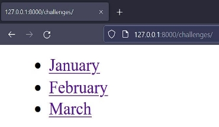 

Now if I go in one of month I see my html file. 

**oo3** 

now we can do better in views, before we use render to string but now its better to use render from django shortcuts. 

from django.shortcuts import render 

but render needs anthor argeumnt named request, now we don’t user it but it can exteact data from page. 

def month\_index(request, month): 

... 

`        `return render(request, "challenges/challenge.html") 

...

**oo4** 

Now if we want show month challenge in html file we can do this, in render we have therd argeumnt in this argeumnt we can push a vriable  

def month\_index(request, month): 

... 

challenge\_text = month\_challenge[month] 

return render(request, "challenges/challenge.html", { 

"challenge\_text": challenge\_text

`        `}) 

...

Now we have accses challenges\_text vriable in html file. 

`    `<h1>this month Challenge</h1>     <h2>{{challenge\_text}}</h2> 

In html files django has Django Template Language (DTL) for use our commands we must put in { { **here** } } 

**oo5** 

If we wanna add name of month in html file we can do this 

def month\_index(request, month): 

... 

challenge\_text = month\_challenge[month] 

return render(request, "challenges/challenge.html", { 

"challenge\_text": challenge\_text, 

`  `"nameofmonth": month.capitalize(),

`        `}) 

...

Now in html file we add  name of month var hash\_neco\templates\challenges\challenge.html 

...

<title>{{nameofmonth}} Challenge</title> ...

<body> 

`    `<h1>{{nameofmonth}} Challenge</h1> 

`    `<h2>{{challenge\_text}}</h2> 

</body> 

Now out put in html file is  

http://127.0.0.1:8000/challenges/january 

<html lang="en"> 

<head> 

`    `<title>January Challenge</title> 

</head> 

<body> 

`    `<h1>January Challenge</h1> 

`    `<h2>this is january challenge:)</h2> 

</body> 

</html> 

**0o6** 

For capitalaze we can do another way to do this. We can delete capitallaze in view** hash\_neco\challenges\views.py 

...

"nameofmonth": month, ...

and in html file we can use template filter.like this: hash\_neco\templates\challenges\challenge.html 

...

<body> 

`    `<h1>{{nameofmonth|title}} Challenge</h1>     <h2>{{challenge\_text}}</h2> 

</body> 

...

{{ nameofmonth|title }} this means you can capital the text in nameofmonth.in django we have a lot of them like: 

**cut** 

Removes all values of arg from the given string. 

For example: 

{{ value|cut:" " }} 

If value is "String with spaces", the output will be "Stringwithspaces". 

Full list : https://docs.djangoproject.com/en/4.0/ref/templates/builtins/#built-in-filter-reference 

**oo8** 

As you know our index page(http://127.0.0.1:8000/challenges/) is work with for loop and render In view but the better way is create a loop in htm fie for each month.so first we must create another html file for this page named index.html hash\_neco\challenges\views.py 

def chall\_index(request): 

`    `months = list(month\_challenge.keys()) 

`    `return render(request, "challenges/index.html", {         "monthnames": months, 

`    `}) 

Here we send all of moth in a list in html file. hash\_neco\templates\challenges\index.html 

...

`  `<body> 

`    `<ul> 

`      ` 

`      `<li><a href="">{{ month|title }}</a></li>        

`    `</ul> 

`  `</body> 

...

In html file we can use for loop with django template language  

Code 

 

We **must** close for loop in DTL(django template language) 

Now the output is: 

URL : http://127.0.0.1:8000/challenges/ <body> 

`    `<ul> 

`      `<li><a href="">January</a></li> 

`      `<li><a href="">February</a></li> 

`      `<li><a href="">March</a></li> 

`    `</ul> 

</body> 

**oo9** 

Now for link location we can do this: 

In <a> tag we do this: href="/challenges/{{ month }}" 

But we have problem if we changes sub url("/challenges/…”) this link dosen’t work. As you see in before we use reverse function for this but in DTL we can’t do this. we can use this  in this tag we have this   (like reverse) hash\_neco\challenges\urls.py 

...

path("<str:month>", views.month\_index, name="month\_index"), ...

The name of this URL is month\_index so we do this: hash\_neco\templates\challenges\index.html 

...

 

<li><a href="">{{ month|title }}</a></li>  

...

httpc127.0.0.1:8000/challenges/ 

<body> 

`    `<ul> 

`      `<li><a href=["/challenges/january"](view-source:http://127.0.0.1:8000/challenges/january)>January</a></li> 

`      `<li><a href=["/challenges/february"](view-source:http://127.0.0.1:8000/challenges/february)>February</a></li>             <li><a href=["/challenges/march"](view-source:http://127.0.0.1:8000/challenges/march)>March</a></li> 

`    `</ul> 

</body> 

**o10** 

Now if one of month dosen’t have challenge text we wanna tell there is no challenge for this month So in dictionary of month for one of month we set challenge text None 

month\_challenge = { 

`    `"january": "this is january challenge:)",     "february": None, 

`    `"march": "this is march challenge:)", 

} 

So now if we go in http://127.0.0.1:8000/challenges/february it shows … 

`    `<h1>February Challenge</h1> 

`    `<h2>None</h2> 

… 

Now in challenge html file we can add some logic with if and else 

 

code 

 

Some code 

 

Now for this job we can do this: 

...

` `<body> 

`    `<h1>{{nameofmonth|title}} Challenge</h1>      

`    `<h2>{{challenge\_text}}</h2> 

`    ` 

`    `<h2>No challenge for {{nameofmonth}}</h2>      

`   `</body> 

...

http://127.0.0.1:8000/challenges/february 

... 

<body> 

`    `<h1>February Challenge</h1> 

`    `<h2>No challenge for february</h2> 

</body> 

... 

**o11** 

as you see when we create a new page we need write all of html file but we can do better with copy all of skeleton of html file, and then evrey thing that page needs more we added for this page.for this we can create a base template folder for our project 

\template 

Now in this folder we crate a base html file 

\template\base.html 

In this file we copy all we need for a base html file like this : 

<!DOCTYPE html> 

<html lang="en"> 

`  `<head> 

`    `<meta charset="UTF-8" /> 

`    `<meta name="viewport" content="width=device-width, initial-scale=1.0" /> 

`    `<title></title> 

`  `</head> 

`  `<body> 

`  `</body> 

</html> 

Now we use block for add data to this page blocks need a name like this  and we need close this block  So for our /challenges url we need customize title and add our month names so we create two tag for this. 

<!DOCTYPE html> 

<html lang="en"> 

`  `<head> 

`    `<meta charset="UTF-8" /> 

`    `<meta name="viewport" content="width=device-width, initial-scale=1.0" />     <title>place holder\*</title> 

`  `</head> 

`  `<body> 

`    ` 

`  `</body> 

</html> 

\*if we don’t have anything from the page for this tag this tx shows but we send something this text is delete 

In index.html file we need do something to read the skeleton file from base.html form the root folder so for doing this we need a new tag named extends.**this tag must be upper than all of codes (first line of codes)**. hash\_neco\templates\challenges\index.html 

 ...

Now index file read base.html file but at first we need tell django where is base.html So in settings file in DIRS(Because this template is root) we add root template folder hash\_neco\settings.py 

TEMPLATES = [ 

...

`        `'DIRS': [ 

`            `BASE\_DIR / "template",         ], 

...

]

Now we can delete all of other code(base code) from index.html.but for month and title of page we can use block tags hash\_neco\templates\challenges\index.html 

 

All challenges 

 

<ul> 

`  ` 

`  `<li><a href="">{{ month|title }}</a></li>    

</ul> 

 

Evreything in block can replace in base. 

Output → http://127.0.0.1:8000/challenges/ 

<!DOCTYPE html> 

<html lang="en"> 

`  `<head> 

`    `<meta charset="UTF-8" /> 

`    `<meta name="viewport" content="width=device-width, initial-scale=1.0" />     <title>All challenges</title> 

`  `</head> 

`  `<body> 

<ul> 

`  `<li><a href=["/challenges/january"](view-source:http://127.0.0.1:8000/challenges/january)>January</a></li>   <li><a href=["/challenges/february"](view-source:http://127.0.0.1:8000/challenges/february)>February</a></li>   <li><a href=["/challenges/march"](view-source:http://127.0.0.1:8000/challenges/march)>March</a></li> </ul> 

`  `</body> 

</html> 

**o12** 

now for challnge pages we add this blocks 

at first we delete unuseles code and then we add extends tag hash\_neco\templates\challenges\challenge.html 

 

And then we add other part in title block and content block. 

{{nameofmonth|title}} Challenge  

`    `<h1>{{nameofmonth|title}} Challenge</h1> 

`    ` 

`    `<h2>{{challenge\_text}}</h2> 

`    ` 

`    `<h2>No challenge for {{nameofmonth}}</h2> 

`    ` 

 

Output → http://127.0.0.1:8000/challenges/march\* 

<!DOCTYPE html> 

<html lang="en"> 

`  `<head> 

`    `<meta charset="UTF-8" /> 

`    `<meta name="viewport" content="width=device-width, initial-scale=1.0" />     <title>March Challenge</title> 

`  `</head> 

`  `<body> 

`    `<h1>March Challenge</h1> 

`    `<h2>this is march challenge:)</h2> 

`  `</body> 

</html> 

\*it can be other month 

**o13** 

now if we wanna add navigation bar to our html we can added in ech file but as you know in more pages we have navigattion so do you think we add to our base temaplate? Omm for main pages nav yes but if our site has different nav we must use **include** tag. 

So in our template app we create a folder named include now in this folder we add header.html file(nav) .\challenges\templates\challenges\includes\header.html 

Now in this file we can create our nav like this: 

\challenges\templates\challenges\includes\header.html 

<header> 

`    `<nav><a href="">All challenges</a></nav> </header> 

In challenges html file and index we can added with include command hash\_neco\templates\challenges\challenge.html **and** hash\_neco\templates\challenges\index.html 

...

 ...

In challenges html file and index file we see this now. 

<header> 

`    `<nav><a href=["/challenges/"](view-source:http://127.0.0.1:8000/challenges/)>All challenges</a></nav> 

</header> 

Include tag has another feature. When we use a varable like nameofmonth in challenges file we have access this var in file we included(header.html) 

...

 

`    `     <h1>{{nameofmonth|title}} Challenge</h1> 

...

 

...

And we can create a new vareable fot this header file like this.now active page is sent in header 

...

 

`    ` 

...

 

...

And another var for index page hash\_neco\templates\challenges\index.html 

...

 

`    `  

...

Now in header file we can add this \challenges\templates\challenges\includes\header.html 

<header> 

`    `<nav>your active page is : {{active\_page}}</nav>     </header> 

To see the var 

 

So if I go in **/challenges** → **active\_page is index** and **in /challenges/february** → **active\_page is challenge** 

**o14** 

**Accessing Dictionary Fields in Templates** 

When accessing dictionary data in a template, you DON'T use this syntax: 

**{{ myDictionary['some\_key'] }}** 

Instead, you use the dot notation - as if it were a regular Python object: 

**{{ myDictionary.some\_key }}** 

This might look strange, but keep in mind, that the DTL is a custom-made language. It looks like Python, but ultimately it is NOT Python - it's a language parsed and executed by Django. Hence, its syntax can deviate - just as it does here. 

**CALLING FUNCTIONS IN TEMPLATES** 

Calling functions in templates also works differently than it does in Python. 

Instead of calling it, you use functions like regular variables or properties. 

I.e., instead of: 

**{{ result\_from\_a\_function() }}** 

you would use 

**{{ result\_from\_a\_function }}** 

**o15** 

as you know our 404 error page is stile load from views.but we can do it from templates like others.So because the 404 page is important we create this file in root template folder. 

\template\404.html 

  somthing went wrong. Please try again.   

 

<h1>404</h1> 

The page you are looking for does not exist.
  

Now for load this we can use render to string again and put the var in HttpResponseNotFound we need import render to string 

from django.template.loader import render\_to\_string

and then when we need 404 error we put this: 

...

response\_data = render\_to\_string("404.html")         return HttpResponseNotFound(response\_data) 

...

But whay we dont render this and we use HttpResponseNotFound because in code we have different this is the standerd form of 404 error 

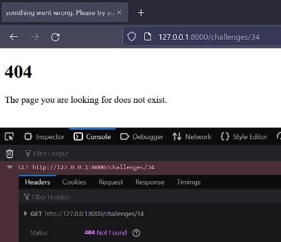

As you see                                here 

But also we can do something better .we import hash\_neco\challenges\views.py 

from django.http import Http404 ...

this and now we can use this: 

...

except: 

raise Http404() ...

Now if in our template we have a 404.html file automatically django return this.but this method only work when **debug** mode on setting is set to **false** 

We can false this prameter but when we do this the **local server dosent work**.only in real server this method works. 

\hash\_neco\ settings.py 

DEBUG = True # we must set False this for using this method

But for now, let's use the previous way.(render\_to\_string) 

Output: url →  http://127.0.0.1:8000/challenges/34 <!DOCTYPE html> 

<html lang="en"> 

`  `<head> 

`    `<title> something went wrong. Please try again. </title> 

`  `</head> 

`  `<body> 

<h1>404</h1> 

The page you are looking for does not exist.
   </body> 

</html> 

**o16** 

Now as you see we don’t have any style so we can add css in two way 

First we add css in html file(internal) but secend way(better way) is we create a sub folder to our project named static 

In static folder we create a sub folder (Because we can add other file type like js) css and in this folder we can create a css file like: mycss.css 

for example, we can add this style to UL tags: 

static\css\mycss.css 

ul { 

`  `list-style: none; } 

Now in base html file we add a new block in head for css hash\_neco\template\base.html 

` `...

<head> 

`    `  </head> 

...

` `Now we can add any different style for each page.like index page.but at first we must create static tag hash\_neco\challenges\templates\challenges\index.html 

...

 ...

Now we can use the static folder 

 

`  `<link rel="stylesheet" href="">  

Now this link goes in base file in head part. 

In href part we enter the folder name and then name of css file. Now if we run still we see the dots for UL tags,why? 

At first we must have this  \hash\_neco\ settings.py 

INSTALLED\_APPS = [ 

`    `'django.contrib.staticfiles', ] 

In installed apps. And then in  

STATIC\_URL = 'static/'

We must show django where is our static file. 

Now we can run again (re run Because it won’t work still, we don’t restart the server) we cant see the dots. But if still we have problem we must add this to setting.py 

STATICFILES\_DIRS = BASE\_DIR, 'static'

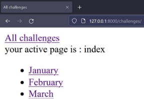 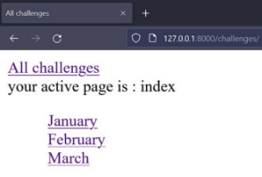

`        `Before                                          After https://github.com/houshmand-2005/hash\_neco/tree/Templates\_and\_Static\_File\_004 

**06** 

**DATA & MODELS **

**oo6** 

ok now for this section I create a new django project named book\_store and in this project, I create an app named books. At first we must add app name in setting 

\book\_store\settings.py 

INSTALLED\_APPS = [     'books', 

] 

Now in this app we have models.py app in this file we can add our models. 

So, for doing this we need a class like book and in this class we have books parameter like title. \book\_store\books\models.py 

class Book(models.Model): 

`    `title = models.CharField(max\_length=50)     rating = models.IntegerField() 

class name\_of\_class(models.Model): 

parameter like title 

Now every parameter has a argument (but not for all) like: title = models.CharField(max\_length=50) rating = models.IntegerField() 

CharField = for string value 

IntegerField = for integer value 

max\_length=50 = max length of string must be 50 

**oo7** 

But in table still we don’t have these parameters.for add these we use this command: 

Python .\manage.py makemigrations 

Out put: 

Migrations for 'books': 

`  `books\migrations\0001\_initial.py 

- Create model Book 

Now in app folder in migration folder we have new migrate file this file made for our models.py file and django translate this file to SQL But for doing this(make tables in database) we must run this: 

python .\manage.py migrate 

as you see we have lots of migrate alongside of our app migrate, these are from internal apps in django like admin panel. 

Now if we see our data base we have these parameters 

\* 

\*DB browser (SQLite) 

**oo8** 

you know if we wanna add any book we use views.py file but for now for learning  we use shell  

python .\manage.py shell 

then we need import Book from models 

\>>> from books.models import Book 

For insert data at first we create a var and make equals with Book() and in this class we have two parameters title and rating so we insert data like this: varnamehere = Book(title="name of book", rating=an integer number like 1) 

\>>> test\_book1 = Book(title="test 1 book", rating=5) 

\>>> test\_book2 = Book(title="test 2 book", rating=2) 

\>>> test\_book1.save() 

\>>> test\_book2.save() 

At end we must save them. 

Now if we use DB browser (SQLite) we can see these parameters 

The id made automatically 

For exit from shell use this: 

\>>> exit() 

**oo9** 

If we want to see our data is saved (if we don’t use DB browser) we can use this:** 

\>>> Book.objects.all() 

<QuerySet [<Book: Book object (1)>, <Book: Book object (2)>]> 

It means we have two parameters in this table. 

**o10** 

now if we want to see the name and rating we can add a function called \_\_str\_\_ and then in this function we can set this like this: 

class Book(models.Model): 

`    `title = models.CharField(max\_length=50) 

`    `rating = models.IntegerField() 

`    `def \_\_str\_\_(self): 

`        `return f'{self.title} - ({self.rating})' 

now if I run Book.objects.all()the out put is:  

<QuerySet [<Book: test 1 book - (5)>, <Book: test 2 book - (2)>]> 

As you see we don’t mograte this file but it works, the methods don’t need the migrate because nothing change in the database. 

now we add some new parameters or change these we like fot ratting we want to number must between 1 and 5 so for doing this we can  Writing validators(https://docs.djangoproject.com/en/4.0/ref/validators/) but also we can use ready validators like 

MaxValueValidator and MinValueValidatorz.for use this validators wedo this: 

class Book(models.Model): 

...

`    `rating = models.IntegerField( 

`        `validators=[MinValueValidator(1), MaxValueValidator(5)]) ...

Now if we add a new parameter like is best seller(get true or false) and add another\_field we can code these 

class Book(models.Model): 

...

`    `another\_field = models.CharField(max\_length=100)     is\_best\_seller = models.BooleanField() 

...

Now if we want to add these parameters we use this command: 

Python .\manage.py makemigrations 

we have an error because the data before these changes they don’t have any data for the parameters so for fix this we can use default or null set true. 

class Book(models.Model): 

...

`    `another = models.CharField(max\_length=100, null=True)     is\_best\_seller = models.BooleanField(default=False) ...

Now if we don’t input the another is set to null and if we don’t input is\_best\_seller is set to False  Python .\manage.py makemigrations 

Out put: 

Migrations for 'books': 

`  `books\migrations\0002\_book\_another\_book\_is\_best\_seller\_alter\_book\_rating.py 

- Add field another to book 
- Add field is\_best\_seller to book 
- Alter field rating on book 

Then we make migrateion 

python .\manage.py migrate 

now we have accses in to the shell to see items 

like this : name\_of\_class.objects.all()[index\_of\_data\_we\_want].nameof\_parameters\_we\_want\_to\_see >>> Book.objects.all()[0].another 

\>>> Book.objects.all()[0].title 

'test 1 book' 

\>>> Book.objects.all()[1].title 

'test 2 book' 

\>>> Book.objects.all()[1].is\_best\_seller 

False 

**o12** 

For update the data we can do like this: 

\>>> book1 = Book.objects.all()[0] 

\>>> book1.another = "test1ofbook1" 

\>>> book1.is\_best\_seller = True 

But changes are not in database they are in just python memory for save changes in data base we must use: >>> book1.save() 

Now you can see the changes 

\>>> Book.objects.all()[0].is\_best\_seller 

True 

\>>> Book.objects.all()[0].another 

'test1ofbook1' 

**o13** 

now for delete a data we can use this method 

\>>> book2 = Book.objects.all()[1] 

\>>> book2 

<Book: test 2 book - (2)> 

\>>> book2.delete() 

(1, {'books.Book': 1}) 

Now the second book is gone 

\>>> Book.objects.all() 

<QuerySet [<Book: test 1 book - (5)>]> 

**o14** 

Ok there is a new way to create a new book in data base like this: 

\>>> Book.objects.create(title="myStory", rating=1, another="test2", is\_best\_seller=False) 

**o15** 

I add some books for filter the data. If we want to query some data the before method isn’t to good(Book.objects.all()[1]) Now we use Book.objects.get() 

Like: 

\>>> Book.objects.get(id=5) 

<Book: Bioshock - (5)> 

Now if I enter an id I deleted before we get an error (the id deleted forever) 

\>>> Book.objects.get(id=2) 

error 

\>>> Book.objects.get(title="myStory") 

<Book: myStory - (1)> 

Now if we query some data and it returned more than one we get an error  

\>>> Book.objects.get(is\_best\_seller=False) 

error 

... get() returned more than one Book -- it returned 3! 

So now if we want to query some data it returned more than one we can use Book.objects.filter() 

\>>> Book.objects.filter(is\_best\_seller=True) 

<QuerySet [<Book: test 1 book - (5)>, <Book: Bioshock - (5)>, <Book: testtherat - (0)>]> Return if we want to use <, =, > we must use this syntax ➔ Book.objects.filter(rating**\_\_lt=3**) 

\_\_lt means lower than 

\>>> Book.objects.filter(rating\_\_lt=3) 

<QuerySet [<Book: myStory - (1)>, <Book: Hello - (2)>, <Book: testtherat - (0)>]> 

More like this syntax: [(https://docs.djangoproject.com/en/4.0/topics/db/queries/)](https://docs.djangoproject.com/en/4.0/topics/db/queries/) 

Also, we can add another if for filter like this: 

\>>> Book.objects.filter(rating\_\_lt=3, is\_best\_seller=True) 

<QuerySet [<Book: testtherat - (0)>]> 

if we want to find a text like something we use TheNameOfVar\_\_contains=”the text”(case sensitive but in SQLite this command is like icontains) and TheNameOfVar\_\_icontains(not case sensitive). 

**o16** 

if we want to add ‘and’ & ‘or’ in query’s we must import Q from django like this: 

\>>> from django.db.models import Q 

and, or: 

\>>> Book.objects.filter(Q(rating\_\_lt=3) | Q(is\_best\_seller=True), Q(title="myStory")) <QuerySet [<Book: myStory - (1)>]> 

the pipe (|) is for OR and ‘,’ is for AND. the comma must be after OR  

**o19** 

now as you know we don’t use models like this so for that lets Bild a simple project and then use models. We must create a template folder 

\book\_store\books\templates\book\_outlet 

And in this folder, we can make these files 

base.html, book\_page.html, index.html 

now we create a URL file for this app and fill with index view 

\book\_store\books\urls.py 

from django.urls import path 

from . import views 

urlpatterns = [ 

`    `path('', views.index, name='index'), ] 

so, for let’s crate a view for this URL \book\_store\books\views.py 

from django.shortcuts import render 

def index(request): 

`    `return render(request, 'book\_outlet/index.html') 

now we must include URL file in base URL file \book\_store\book\_store\urls.py 

from django.urls import path, include urlpatterns = [ 

`    `...

`    `path('', include('books.urls')) 

] 

Now in base.html file we create base html thing for other pages. \book\_store\books\templates\book\_outlet\base.html 

<!DOCTYPE html> 

<html lang="en"> 

<head> 

`    `<meta charset="UTF-8"> 

`    `<meta name="viewport" content="width=device-width, initial-scale=1.0">     <title></title> 

</head> 

<body> 

`    ` 

`    ` 

</body> 

</html> 

And now for test we fill index.html \book\_store\books\templates\book\_outlet\index.html 

  

All Books

 

 

<ul> 

`    `<li> 

`        `book 

`    `</li> 

</ul> 

 

**o20** 

now we use models how? In our views.py file we query data from database and pass into the template 

at first we need import our Books class then we query all the data and then we send in to the template by ‘books’ name. Like this: \book\_store\books\views.py 

from .models import Book 

def index(request): 

`    `books = Book.objects.all() 

`    `return render(request, 'book\_outlet/index.html', {         "books": books 

`    `}) 

Now in index file we use this data with for loop \book\_store\books\templates\book\_outlet\index.html 

 

<ul> 

`    ` 

`    `<li> 

`        `{{ book.title }} rating: {{ book.rating }}     </li> 

`    ` 

</ul> 

 

Output: 

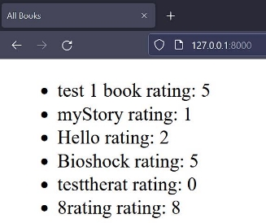

Now we have the books from database. **o21** 

Now let’s create book page for this we need a view.as you now in book page we want to user see one book and details of that. We must query data by id of books. Then we render it. 

\book\_store\books\views.py 

def book\_page(request, id): 

book = Book.objects.get(pk=id)     

`    `return render(request, 'book\_outlet/book\_page.html', {         "title": book.title, 

`        `"another": book.another, 

`        `"reting": book.rating, 

`        `"is\_best\_seller": book.is\_best\_seller

`    `}) 

This command is for query by id and pk it means primary key like id.so when the id we give it to this it looks for the same id and get details of that.  

book = Book.objects.get(pk=id)    

means 

now we need id from URLs so let’s create URL for that \book\_store\book\_store\urls.py 

urlpatterns = [ 

`    `...

`    `path("<int:id>", views.book\_page, name="book\_page") ] 

Now in book page we add these parameters. \book\_store\books\templates\book\_outlet\book\_page.html 

 

 

{{title}}    

 

 

<h1>{{title}}</h1> 

<h2>{{another}}</h2> 

this book has a rating of {{reting}} and {{another}}  

and is the bestseller.

 

but isn't the bestseller

 
 

 

Output: 

But if we enter some id, we don’t have in database what we can do? We can use try and except \book\_store\books\views.py 

from django.http import Http404 

def book\_page(request, id): 

`    `try: 

`        `book = Book.objects.get(pk=id)     except: 

`        `raise Http404() 

...

But we can use another way (its smaller) but at first, we need import something 

from django.shortcuts import render, get\_object\_or\_404 and now if there is no object by id it’s give us 404 get\_object\_or\_404(NameOfModels, Condition) 

def book\_page(request, id): 

`    `book = get\_object\_or\_404(Book, pk=id) 

**o22** 

In main page now we want add link for each month a to the book\_page of those books In index.html file we can solve this with two ways. First way: \book\_store\books\templates\book\_outlet\index.html 

...

 

`  `<a href=""> 

`    `<li>{{ book.title }} rating: {{ book.rating }}</li>   </a>  

 

...

In this way we use the book id. 

Second way: 

In this way also we get the id of book and with reverse method we create the link. \book\_store\books\models.py 

from django.urls import reverse

class Book(models.Model): 

...

`    `def get\_absolute\_url(self): 

`        `return reverse("book\_page", args=[self.id])

and in index.html we use this method we create. 

\book\_store\books\templates\book\_outlet\index.html 

...

 

<a href="{{ book.get\_absolute\_url }}"> 

`    `<li>{{ book.title }} rating: {{ book.rating }}</li>   </a> 

 

...

Output: 

<body> 

`        `<ul> 

`            `<a href="/1"> 

`                `<li>test 1 book rating: 5</li>             </a> 

`            `<a href="/3"> 

`                `<li>myStory rating: 1</li> 

`            `</a> 

`            `<a href="/4"> 

`                `<li>Hello rating: 2</li> 

`            `</a> 

`            `<a href="/5"> 

`                `<li>Bioshock rating: 5</li> 

`            `</a> 

`            `<a href="/6"> 

`                `<li>testtherat rating: 0</li>             </a> 

`            `<a href="/7"> 

`                `<li>8rating rating: 8</li> 

`            `</a> 

`        `</ul> 

`    `</body> 

**o23** 

Output but return by id is not very good for SEO so we use slug.so for this in models we add a new var called slug \book\_store\books\models.py 

class Book(models.Model): 

`    `slug = models.SlugField(default="", null=False) 

this slug field just hold slugs 

now if we add a new book also, we add slug but what about old books? 

We can create a new method for save (over writing save method) now for overwrite this we need ‘args’ and ‘kwarg’ 

from django.utils.text import slugify class Book(models.Model): 

...

def save(self, \*args, \*\*kwargs): 

self.slug = slugify(self.title) super().save(\*args, \*\*kwargs) 

now if we save a book this method load and create slug by title title = “This is title 2” ➔ slug = “this-is-title-2” 

now for apply these changes we need make migrations python .\manage.py makemigrations 

python .\manage.py migrate 

now we need save all books to add slug, so we use shell python .\manage.py shell 

\>>> from books.models import Book 

\>>> Book.objects.get(title="Hello").save() >>> Book.objects.get(title="Hello").slug 

'hello' 

Books now we need do this for all books so we can use python power :) >>> for i in range(1,8): 

...      if i != 2: 

...              Book.objects.get(id=i).save() (if i != 2  because I don’t have id 2 and python gets error) 

Output: 

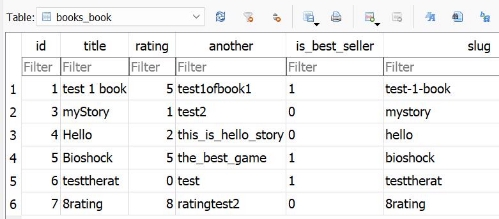

**o24** 

Now if we want to link books to their page with slug, we need do this: The URL segment we use must be slug so for that we do this: \book\_store\books\urls.py 

urlpatterns = [ 

`    `path('', views.index, name='index'), 

`    `path("<slug:slug>", views.book\_page, name="book\_page") ] 

And so, we need change id to slug in views (slug=slug means when the slug we enter is a slug in database then give it) \book\_store\books\views.py 

def book\_page(request, slug): 

`    `book = get\_object\_or\_404(Book, slug=slug) 

...

And if you remember in get\_absolute\_url we use id, so we change this to \book\_store\books\models.py 

class Book(models.Model): 

...

`    `def get\_absolute\_url(self): 

`        `return reverse("book\_page", args=[self.slug]) 

we can also do something to have better performance how by add indexing to slug model(it doesn’t need migration) 

class Book(models.Model): 

...

`    `slug = models.SlugField(default="", null=False, db\_index=True) 

Output: 

<body> 

`    `<ul> 

`        `<a href="/test-1-book"> 

`            `<li>test 1 book rating: 5</li>         </a> 

`        `<a href="/mystory"> 

`            `<li>myStory rating: 1</li> 

`        `</a> 

`        `<a href="/hello"> 

`            `<li>Hello rating: 2</li> 

`        `</a> 

`        `<a href="/bioshock"> 

`            `<li>Bioshock rating: 5</li> 

`        `</a> 

`        `<a href="/testtherat"> 

`            `<li>testtherat rating: 0</li>         </a> 

`        `<a href="/8rating"> 

`            `<li>8rating rating: 8</li> 

`        `</a> 

`    `</ul> 

</body> 

**o25** 

now also we can add total number of books and avg rating so let’s do this so, in index function we can do this. 

\book\_store\books\views.py 

def index(request): 

`    `books = Book.objects.all()     num\_books = books.count() 

we use the book var not create a query because it’s too bad for performance and for avg or like this (min and max) we need import this: 

from django.db.models import Avg 

then we say which models needs avg 

def index(request): 

`    `books = Book.objects.all() 

`    `num\_books = books.count() 

`    `avg\_rating = books.aggregate(Avg('rating')) 

now we passed these to context dictionary 

def index(request): 

...

`    `return render(request, 'book\_outlet/index.html', {         "books": books, 

`        `"total\_count": num\_books, 

`        `"avg\_rating": avg\_rating

`    `}) 

And now we can add these var to index.html file \book\_store\books\templates\book\_outlet\index.html 

 

...

total number of books: {{ total\_count }}
 
avg rating : {{avg\_rating }}
 

 

Output: 

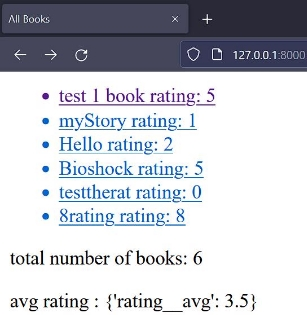

But as you see the avg give us a dictionary for get just value we can do this: 

 

...

avg rating : {{avg\_rating.rating\_\_avg }}
  

Now its just return the value 

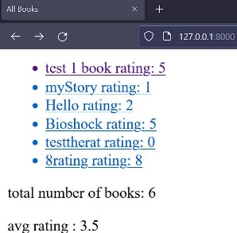

Also, we can order these books like by title \book\_store\books\views.py 

def index(request): 

`    `books = Book.objects.all().order\_by("title") 

its order the books with title by A to Z and if we want to do this by Z to A, we can do this: 

`    `books = Book.objects.all().order\_by("-title")

Output: 

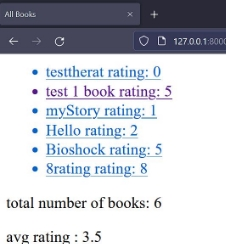

https://github.com/houshmand-2005/hash\_neco/tree/Data\_and\_Models\_06 

**07 ADMIN **

**oo2** 

Now as you know if we want to add a book we must go in shell and insert the data but if we have interface for that it’s too better. So, we can create some but django for this has a ready template. 

Now if you remember in url.py file we have a built in URL called /admin 

\book\_store\books\urls.py 

urlpatterns = [ 

`    `path('admin/', admin.site.urls), ] 

Now if we enter this address what happen? 

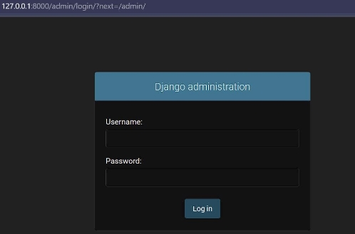

Ok but how we log in we don’t have username or password, so we create one python .\manage.py createsuperuser 

Username (leave blank to use 'amir'): houshmand Email address: test@gmail.com 

Password: \* 

Password (again): \* 

Superuser created successfully. 

\*You can’t see when you type your password. 

Ok now we can log in 

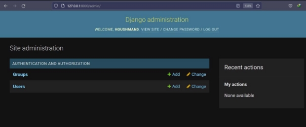

35 
**oo3** 

now if we want to add book with admin panel, we can do it very simple.at first we need import our models next we need register the books models like this: 

\book\_store\books\admin.py 

from django.contrib import admin from .models import Book admin.site.register(Book) 

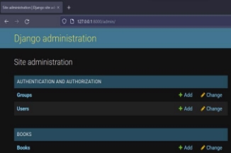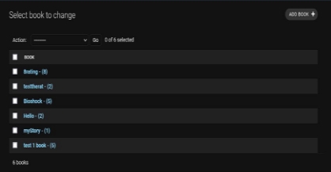

And now we can delete or add or edit the data and see books. Now as you know the slug field fill automatically but if in the admin panel, we want to add a book we need fill the slug but after we enter something it overwritten anyways. 

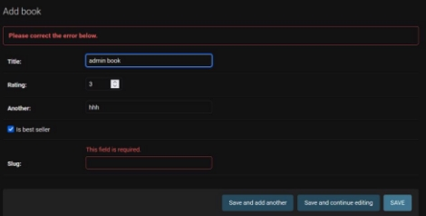

So, we need customize this panel. 

` `**oo4** 

so now for doing this we can set blank = true in slug field and then its work with empty data (as you are now it’s never going to be empty) but if we want its never show up, we can set editable = false like this: 

\book\_store\books\models.py 

class Book(models.Model): 

`  `...

`    `slug = models.SlugField(default="", null=False, 

`                            `db\_index=True, editable=False, blank=True) 

now if we go in admin panel the slug field is not showing up 

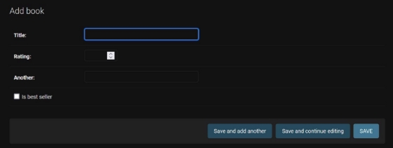

37 
**oo5** 

also, we can do a better way to do this. We can add a class in admin.py file and add var for doing this like this: \book\_store\books\admin.py 

class BookAdmin(admin.ModelAdmin):     readonly\_fields = ("slug",) 

now this field get our field to set it to read only like slug (it’s tuple so we add comma at the end) when we register our models, we need to add this class like this: 

admin.site.register(Book, BookAdmin) 

now we can delete the read only field in slug models \book\_store\books\models.py 

class Book(models.Model): 

...

`    `slug = models.SlugField(default="", null=False,                             db\_index=True, blank=True) 

Output:** 

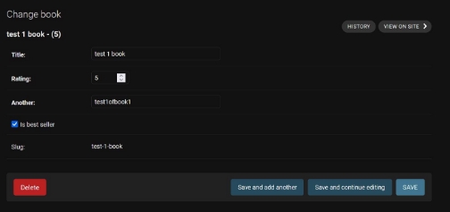
**
` `now if we write the title the slug creates live, and we see it for do this we need do this add a new var for this like this: 

\book\_store\books\admin.py 

class BookAdmin(admin.ModelAdmin): 

`    `readonly\_fields = ("slug",) 

`    `prepopulated\_fields = {"slug": ("title",)} 

it’s a dict and we say we need ore populate which field and fill it with what field. But if we run this, we get an error 

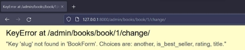

As you see slug is not show because it read only so we can delete read only part 

class BookAdmin(admin.ModelAdmin): 

`    `prepopulated\_fields = {"slug": ("title",)} 

Output: 

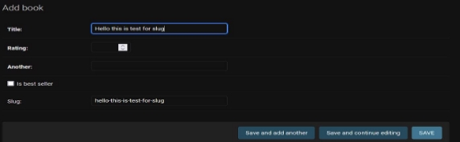

39 

As you now user now can edit this field but after save its overwritten so we can delete the save def  \book\_store\books\models.py 

class Book(models.Model): 

- def save(self, \*args, \*\*kwargs):
- self.slug = slugify(self.title)
- super().save(\*args, \*\*kwargs)

But now if user edit the slug and its turn to unvalidated field django can control this. 

**oo6** 

so now if we want to add filter by some field like this pic: 

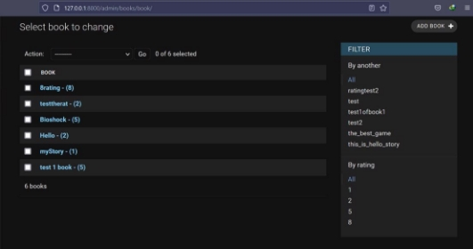

We need add a list of filter field like this: \book\_store\books\admin.py 

class BookAdmin(admin.ModelAdmin): 

`    `...

`    `list\_filter = ("another", "rating") 

now its work and we get this filter part 

but we can add some columns for another field like best seller or … like this pic: 

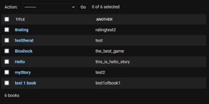

\book\_store\books\models.py 

For this we need create a list for this named list display 

class BookAdmin(admin.ModelAdmin): 

`   `... 

`    `list\_display = ("title", "another") 

now we had done for admin panel. https://github.com/houshmand-2005/hash\_neco/tree/Admin\_07 

41 

**08 RELATIONSHIPS **

**oo3 (one-to-many)** 

So, as you now field may have a connection with another field, like ‘another’ (author but as you are now, I write it uncorrected so let’s keep with this) 

Like we want to add first name and last name for this, and we also want use in different table or something 

So, we create a new class for this field 

class Another(models.Model):  # Author

`    `first\_name = models.CharField(max\_length=100)     last\_name = models.CharField(max\_length=100) 

now if we want to create a connection with Book class, we need add a foreign key field. On foreign key we need say name of the class we want to connection with, so we type Another and, we need add something else, if we delete another data like first name what happen in the book models for that we have to many options like CASCADE this field delete data from another and from Book class, so the data is completely delete. Also, we add null to true to we can migrate (because the database doesn’t have any data now for Another class) 

class Book(models.Model): 

...

`    `another = models.ForeignKey(Another, on\_delete=models.CASCADE, null=True) 

ok now we can make migrations: 

python .\manage.py makemigrations 

but we get error because  we already have some another data as you remember 

so django can’t apply these changes so we have some few ways because the database must design at first. Now for this we can easily delete the data. 

python .\manage.py shell 

\>>> from books.models import Book 

\>>> Book.objects.all().delete() 

(6, {'books.Book': 6}) 

\>>> exit() 

python .\manage.py makemigrations 

... 

python .\manage.py migrate 

Operations to perform: 

`  `Apply all migrations: admin, auth, books, contenttypes, sessions 

Running migrations: 

`  `Applying books.0004\_another\_alter\_book\_slug\_alter\_book\_another... OK 

now we add the relationships between Book and Another class 

**oo4** 

now if we want to add a new book, we can use shell and admin panel but for now we work with shell 

so, we open shell** 

\>>>python .\manage.py shell 

\>>>from books.models import Book, Another 

and we create a new another field 

\>>> houshmand = Another(first\_name="amir mohammad", last\_name="houshmand") >>>houshmand.save() 

\>>>Another.objects.all()[0].first\_name 

'amir mohammad' 

And now we create a book and connect another field to Another table field like this 

\>>>testbook1 = Book(title="new test book 1", rating=4, another=houshmand, is\_best\_seller=1, slug="new-test-book-1") 

Connect as you see for connect we just say the name of variable of another(houshmand) and because we delete the save method for slug new we need handmade this(if we use admin panel its ok). 

\>>> testbook1.save() 

\>>> Book.objects.all() 

<QuerySet [<Book: new test book 1 - (4)>]>  

now if we want to see another data of this book, we can do this: 

\>>>get\_another\_tbook1 = Book .objects.get(title="new test book 1") 

we store the result of book in a new variable and then we get another field 

As you see django goes in ‘Another’ table 

\>>> get\_another\_tbook1.another.first\_name 'amir mohammad' 

\>>> get\_another\_tbook1.another.last\_name 'houshmand' 

 

As you see django connect them by id 

**oo5** 

ok now if we need find all book from another field or find another by a book, we can do this:  

python .\manage.py shell 

\>>> from books.models import Another, Book 

And now we create a variable for all books by another field 

\>>> books\_by\_houshmand = Book.objects.filter(another\_\_last\_name="houshmand") 

\>>> books\_by\_houshmand 

<QuerySet [<Book: new test book 1 - (4)>]> 

Now for found books for another field we do this: 

\>>> houshmand = Another.objects.get(first\_name="amir mohammad") 

\>>> houshmand 

<Another: Another object (1)> 

\>>> houshmand.book\_set <django.db.models.fields.related\_descriptors.create\_reverse\_many\_to\_one\_manager.<locals>.Rela tedManager object at 0x0000023B664E0F70> 

\>>> houshmand.book\_set.all() 

<QuerySet [<Book: new test book 1 - (4)>]> 

For this as you see we use \_set for find it by we have another way 

We can add a related name dor findit byt this name like 

class Book(models.Model): 

`  `...

`   `another = models.ForeignKey( 

`        `Another, on\_delete=models.CASCADE, null=True, related\_name="books") 

Because we change this field, we need do migration 

python .\manage.py  makemigrations 

python .\manage.py migrate 

now we have access to find it by books 

\>>> houshmand.books.all() 

<QuerySet [<Book: new test book 1 - (4)>]> Now also we can add filter 

\>>> houshmand.books.get(rating\_\_gt=3) <Book: new test book 1 - (4)> 

**oo6** 

now if want to add this another table to admin panel we can added by this command \book\_store\books\admin.py 

from .models import Book, Another admin.site.register(Another) 

output: 

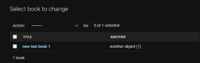 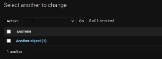

\book\_store\books\models.py 

class Another(models.Model):  # Author

`    `def full\_name(self): 

`        `return f'{self.first\_name} {self.last\_name}'     def \_\_str\_\_(self): 

`        `return self.full\_name() 

why we just didn’t add this code to \_\_str\_\_ because when we code like this we can access in template and more …  output: 

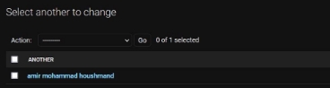 

**oo7 (one-to-one)** 

now if we want to add a relation with one-to-one like for another field, we can do this 

class Address(models.Model): 

`    `street = models.CharField(max\_length=100) 

`    `city = models.CharField(max\_length=100) 

`    `postal\_code = models.CharField(max\_length=10) 

as you see we create a class for another field address so now how we connect this class to another class 

class Another(models.Model):  # Author

`    `address = models.OneToOneField( 

`        `"Address",  on\_delete=models.CASCADE, null=True) 

Now for one-to-one relation we didn’t use foreign key we use one to one field. And we set null to true for older another field. And now we run the migrations 

python .\manage.py makemigrations 

python .\manage.py migrate 

**oo8** 

ok now let’s add some address to another field by shell 

python .\manage.py shell 

\>>> from books.models import Another,Address, Book 

And now add new address 

\>>> addr1 = Address(street="test street num 1", postal\_code="2534", city="london") >>> addr2 = Address(street="test street num 2", postal\_code="95433", city="mashhad") 

Ok now let’s save them 

\>>> addr1.save() 

\>>> addr2.save() 

Ok but now if we want to add an address for another field, we need do this: 

\>>> houshmand = Another.objects.get(last\_name="houshmand") 

\>>> houshmand.address 

\>>> houshmand.address = addr1 

\>>> houshmand.save() 

As you see we at first query another field and then we add the addr1 to this field. 

\>>> houshmand.address 

<Address: Address object (1)> 

\>>> houshmand.address.street 

'test street num 1' 

And now also we can get another field by address like this: 

\>>> Address.objects.all() 

<QuerySet [<Address: Address object (1)>, <Address: Address object (2)>]> >>> Address.objects.all()[0].another 

<Another: amir mohammad houshmand> 

 

**oo9** 

now for show this Address table in admin panel we add it like this: \book\_store\books\admin.py 

from .models import Book, Another, Address admin.site.register(Address) 

output: 

But we need fix the how names are show \book\_store\books\models.py 

class Address(models.Model): 

...

`    `def \_\_str\_\_(self): 

`        `return f"{self.street}, {self.city}, {self.postal\_code}" 

output: 

Now as you see in this picture:  

It is not very good name for Address field so we can change it!** 

class Address(models.Model): 

...

class Meta: 

verbose\_name\_plural = ("Addresses Entries") 

now in Address class we can create another class named meta and now we set a variable for that. 

**o10 (many-to-many)** 

And now many to many relationships. we can add a country table to store which book publish in which country so for this we create a new model 

class Country(models.Model): 

`    `name = models.CharField(max\_length=80)     code = models.CharField(max\_length=2) 

now in our book model we need add it to 

class Book(models.Model): 

`    `publish\_country = models.ManyToManyField(Country) 

and as you see we don’t enter on delete parameter you now why? Because in many to many django create a new table to store it not on Book not in Country and so if it deletes, its delete from all models. 

Now we need do migrations 

python .\manage.py makemigrations 

python .\manage.py migrate 

**o11** 

Now let’s create a country and add the relationships 

python .\manage.py shell 

\>>> from books.models import Book, Country   

\>>> Book.objects.all() 

<QuerySet [<Book: new test book 1 - (4)>]> 

\>>> ntb = Book.objects.all()[0]  

\>>> ntb.publish\_country <django.db.models.fields.related\_descriptors.create\_forward\_many\_to\_many\_manager.<locals>.Man yRelatedManager object at 0x0000026A48072380> 

\>>> ntb.publish\_country.all() 

<QuerySet []> 

Now as you see we don’t have any country data so let’s add 

\>>> usa = Country(name="usa", code="us") 

\>>> usa.save() 

And now for add the relationships we can’t use equal (=) because this isn’t for many to many for this we use add () like this 

\>>> ntb.publish\_country.add(usa) 

\>>> ntb.publish\_country.all() 

<QuerySet [<Country: Country object (1)>]> 

\>>> ntb.publish\_country.filter(code="us") 

<QuerySet [<Country: Country object (1)>]> 

Also, we can do this as reverse 

\>>> Country.objects.all() 

<QuerySet [<Country: Country object (1)>]> 

\>>> usa\_co = Country.objects.all()[0] 

\>>> usa\_co.book\_set.all() 

<QuerySet [<Book: new test book 1 - (4)>]> 

**o12** 

so, for add the country table to admin panel like before we add it 

\book\_store\books\admin.py 

from .models import Book, Another, Address, Country admin.site.register(Country) 

**output:** 

Also, its better to change how its shows the name of country 

class Country(models.Model): 

...

`    `def \_\_str\_\_(self): 

`        `return self.name 

output: 

And when we want to add book and select the country, we can select multiples countries 

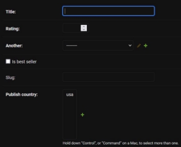

(Because its many to many) 

https://github.com/houshmand-2005/hash\_neco/tree/relationships\_08 

**10 FORMS **

**oo2** 

So now if user wants to login or something like this, we must have Forms so let’s started this by create a base project. Like this: │   .gitignore 

│   db.sqlite3 

│   manage.py 

│ 

├───feedback 

│   │   asgi.py 

│   │   settings.py 

│   │   urls.py 

│   │   wsgi.py 

│   │   \_\_init\_\_.py 

│   │ 

│   └───\_\_pycache\_\_ 

│           settings.cpython-310.pyc 

│           urls.cpython-310.pyc 

│           wsgi.cpython-310.pyc 

│           \_\_init\_\_.cpython-310.pyc 

│ 

├───reviews 

│   │   admin.py 

│   │   apps.py 

│   │   models.py 

│   │   tests.py 

│   │   urls.py 

│   │   views.py 

│   │   \_\_init\_\_.py 

│   │ 

│   ├───migrations 

│   │       \_\_init\_\_.py 

│   │ 

│   └───\_\_pycache\_\_ 

│           urls.cpython-310.pyc 

│           views.cpython-310.pyc 

│           \_\_init\_\_.cpython-310.pyc 

│ 

└───templates 

`    `└───reviews 

`            `reviews.html 

ok now in URL.py file of app we write this for main URL 

\feedback\reviews\urls.py 

from django.urls import path from . import views urlpatterns = [ 

`    `path("", views.review) ] 

(Side note :) yes, I change my theme of IDE before I write code in vs code now is in PyCharm) And in views file write this (for now): 

\feedback\reviews\views.py

def review():     pass 

and because we add a URL file in app, we need include it \feedback\feedback\urls.py 

from django.urls import path, include 

urlpatterns = [ 

`    `path('admin/', admin.site.urls),     path("", include("reviews.urls")) ] 

**oo3** 

So now let’s add a simple form.at first we need add our app in setting.py \feedback\feedback\settings.py 

INSTALLED\_APPS = [     ... 

`    `'reviews' 

] 

And now let’s create form in html file 

\feedback\templates\reviews\reviews.html

<!DOCTYPE html> 

<html lang="en"> 

<head> 

`    `<meta charset="UTF-8"> 

`    `<title>Your Review</title> 

</head> 

<body> 

<form> 

`    `<label for="username">Your name:</label> 

`    `<input id="username" name="username" type="text">     <button>Send</button> 

</form> 

</body> 

</html> 

The ‘for’ element in label is for what label is for what input. And then we add a button. But still, we can’t see it because we didn’t add this page to views.py so let’s doit 

\feedback\reviews\views.py 

from django.shortcuts import render 

def review(request): 

`    `return render(request, "reviews/reviews.html") 

so now this is the output: 

But we something we have here, and this is about the URL when we press button. When your name filed is empty and we press the button the URL is: 

http://127.0.0.1:8000/?username=

But if we enter something like “test” the URL changed to  http://127.0.0.1:8000/?username=test 

But what is this and why this is too important? In next part we can find out **oo4** 

type of Button tag in default is submit when we use this type its like this but if we use Button type then when we click nothing happening. \feedback\templates\reviews\reviews.html

<button type="button">Send</button> 

Like this: 

http://127.0.0.1:8000/ click on the button ➔ http://127.0.0.1:8000/  

but we want to say what is the username for login because we need the data. So, I change it to submit <button type="submit">Send</button> 

But let’s see the different by **GET** and **POST.** 

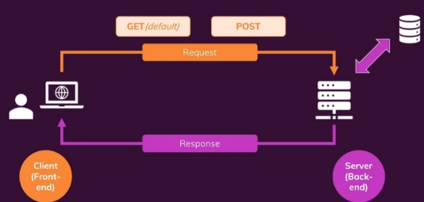

Ok but now when we click the button, still we use GET because this is the default but as you are now, we need Post data to submit it. But for that we need set this form to POST how? Like this: 

<form method="post"> 

... 

</form> 

And now if we press the button, we see we called it to POST 

 

But we get an error when we submit it by button 

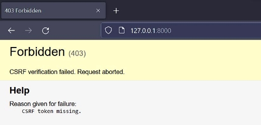

**oo5** 

this error is because we didn’t load the CSRF token ok but what is CSRF token. This tag can protect server from fake request for more information please see this video (S10 E5). Ok now for add this tag we can do this: 

<form method="post"> 

`    ` 

`    `<label for="username">Your name:</label> 

`    `<input id="username" name="username" type="text"> 

`    `<button type="submit">Send</button> 

</form> 

Now if we reload the page, we see a new input (this input made automatically by CSRF token and the value in this tag is random) Output: 

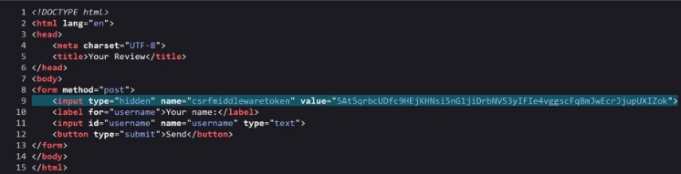

Now we can submit the data. **oo6** 

ok now let’s extract the data in input and redirect to another page. for the redirect part we can create a page for this so  \feedback\templates\reviews\thank\_you.html 

<!DOCTYPE html> 

<html lang="en"> 

<head> 

`    `<meta charset="UTF-8">     <title>Title</title> </head> 

<body> 

<h1>Thank you!</h1> </body> 

</html> 

And create a URL for it \feedback\reviews\urls.py 

urlpatterns = [ 

`    `... 

`    `path("thank\_you", views.thank\_you) ] 

ok now let’s extract the data  \feedback\reviews\views.py

from django.http import HttpResponseRedirect 

... 

def review(request): 

`    `if request.method == "POST": 

`        `entered\_username = request.POST['username']         print(entered\_username) 

`        `return HttpResponseRedirect("thank\_you") 

return render(request, "reviews/reviews.html") 

ok at first, we check the request is Post or no (because see user input the data or no) next we save the data from username input\* \feedback\templates\reviews\reviews.html

\*<form method="post"> 

`    `<input id="username" name="username" type="text"> </form> 

Then we can insert that data in database but for now just print it. 

And then we redirect the user to thank you URL (we did not create it for now) but if the request is not POST we just render the reviews 

page. now let create a thank you view \feedback\reviews\views.py

def thank\_you(request): 

`    `return render(request, "reviews/thank\_you.html") 

Output: 

http://127.0.0.1:8000/ ➔ insert “houshmand” then click the button ➔ http://127.0.0.1:8000/thank\_you  ➔ and the log is: [15/Jun/2022 19:05:17] "POST / HTTP/1.1" 302 0 

Houshmand 

**oo7** 

ok as you now if we did not insert data and click on button, we go to thank you page, but we don’t do this we bust add an error for that to user understands own mistake. 

Ok for this we need another if. So, if user input nothing then clicks the button has\_error is set to True but if not is set to False 

def review(request): 

`    `if request.method == "POST": 

`        `entered\_username = request.POST['username'] 

`        `if entered\_username == "": 

`            `return render(request, "reviews/reviews.html", { 

`                `"has\_error": True 

`            `}) 

`        `print(entered\_username) 

`        `return HttpResponseRedirect("thank\_you") 

`    `return render(request, "reviews/reviews.html", {         "has\_error": False 

`    `}) 

def thank\_you(request): 

`    `return render(request, "reviews/thank\_you.html") 

and in reviews page we need an If for this \feedback\templates\reviews\reviews.html

<form method="post"> 

`    ` 

`    ` 

`        `
This form is invalid - please enter a valid username 
      

`     `... 

</form> 

And now if user do nothing and click the button this message shows up. 

 

And in log we don’t have anything([15/Jun/2022 19:51:30] "POST / HTTP/1.1" 200 502) 

 

Log: 

[15/Jun/2022 19:52:22] "GET / HTTP/1.1" 200 428 

test 1 

but if we have a lots of input or lots of conditions, we can use django form class, we use it in next lesson. 

**oo8** 

now with form class we can do this automatically. For that we need a new file named forms.py (we can change the name) 

in this file we need import form django and create a class for the form we need in this from we add the parameters we need for form. \feedback\reviews\forms.py 

from django import forms 

class ReviewForm(forms.Form): 

`    `user\_name = forms.CharField() 

just like models we enter type of inputs. Then in views.py file we need change code with this \feedback\reviews\views.py 

from .forms import ReviewForm 

def review(request): 

`    `if request.method == "POST": 

`        `form = ReviewForm(request.POST) 

`        `if form.is\_valid(): 

`            `print(form.cleaned\_data) 

`            `return HttpResponseRedirect("/thank\_you")     else: 

`        `form = ReviewForm() 

`    `return render(request, "reviews/reviews.html", {         "form": form 

`    `}) 

ok now if user wants to enter the data, we can find out with request. ReviewForm(request.POST) and we don’t need to check user to for empty input because we use form and django automatically check the input with parameters in forms.py so if user just click the button and doesn’t enter the data in input django gets error to the user. We check this with form.valid(gets True or False value) and for get the data 

we use from.cleand\_data this gives us a dictionary. And in reviews.html we can add the inputs automade \feedback\templates\reviews\reviews.html 

<body> 

<form method="post"> 

`    ` 

`    `{{ form }} 

`    `<button type="submit">Send</button> </form> 

</body> 

Now lets see the output: 

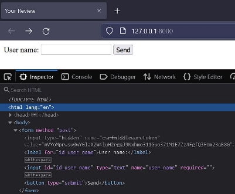

As you see this html code are made by django 

If I just click the button and I don’t enter data in input django handled this 

 

And in log: 

[16/Jun/2022 11:41:08] "GET / HTTP/1.1" 200 529 

{'user\_name': 'test 1'} 

**oo9** 

ok in html code as you see django added required to input but if we delete this html code what’s happen <input type="text" name="user\_name" **required=""** id="id\_user\_name">  

After delete **required=""** and click too the button with no data: 

We get an error message. 

Also we can change the text of error or label or add style to it. 

**o10** 

now let’s change some attributes \feedback\reviews\forms.py 

class ReviewForm(forms.Form): 

`    `user\_name = forms.CharField(label="Your Name", max\_length=20) 

As you see we change the label and add a max length. Now if I enter some data more than 20 characters, we get an error (if we delete the max length In html). 

Also, we can change the text of errors 

For this we need do this: 

class ReviewForm(forms.Form): 

user\_name = forms.CharField(label="Your Name", max\_length=20, error\_messages={         "required": "Your name must not be empty", 

`        `"max\_length": "please enter a shorter name!" 

`    `}) 

now if I delete the max length and enter more than 20 characters I get this error: 

As you see our message shows up. And let’s delete the required field 

Also, we can set required to false if we want for this input 

class ReviewForm(forms.Form): 

`    `user\_name = forms.CharField(label="Your Name", required=False, ... 

now we don’t have this required validation 

but I don’t like required false for this input so I can set it to true but in default is set to true, so I delete this parameter. For more knowledge for this you can visit this : https://docs.djangoproject.com/en/4.0/ref/forms/fields/ 

**o11** 

now if we want to change the how display this input we can do this(we want show the error messages a bow the input) \feedback\templates\reviews\reviews.html 

<form method="post"> 

`    ` 

`    `{{ form.user\_name.label\_tag }}     {{ form.user\_name }} 

`    `{{ form.user\_name.errors }} 

`    `<button type="submit">Send</button> </form>

With this method we have accses to the different part of the form like this Output: 

Now as you see in the different site when they have error they change some styling like add a red color or something for that we can to this:  

 

 {{ form.user\_name.label\_tag }} 

{{ form.user\_name }} 

{{ form.user\_name.errors }} 
 

Now if user has error the class weel be form-control errors like this: 

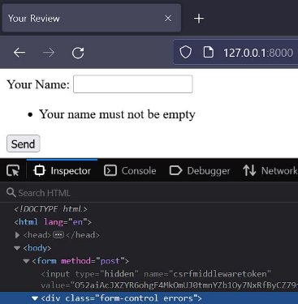

**o12** 

now for add some style we can create a folder for that 

\feedback\reviews\static\reviews\styles.css 

body { 

`    `font-family: sans-serif; 

} 

button { 

`    `cursor: pointer; 

`    `padding: 0.5rem 1.5rem; 

} 

button:hover,button:active { 

`    `background-color: antiquewhite; 

} 

.errorlist { 

`    `list-style: none; 

`    `margin: 0.5rem 0; 

`    `padding: 0; 

`    `color: #a71212; 

} 

.errors label { 

`    `color: #a71212; 

} 

some basic CSS and in reviws html file 

<head> 

`    `<link rel="stylesheet" href=""> </head> 

Now if we have error this is the output: 

58 
**o13** 

now as you know we want to user add his or her reviews to something, so we need more input like the review text and rating so for this we add those filed. 

\feedback\reviews\forms.py 

class ReviewForm(forms.Form): 

`    `... 

`    `review\_text = forms.CharField(label="Your Feedback",      

`    `widget=forms.Textarea, max\_length=200) 

`    `rating = forms.IntegerField(label="Your Rating", min\_value=1,       max\_value=5) 

ok for the review text we need some bigger space for long text like text area for this we add widget and set it to forms.textarea. 

now if we save and look the output we did not see any changes because we dont add these input in html (beacse we render the form 

manually). 

We can copy what we write for name input like this: 

\feedback\templates\reviews\reviews.html 

<form method="post"> 

`    ` 

`    `
 

`    `{{ form.user\_name.label\_tag }} 

`    `{{ form.user\_name }} 

`    `{{ form.user\_name.errors }}

`    `
 

`    `
     {{ form.review\_text.label\_tag }}  

`    `{{ form.review\_text }} 

`    `{{ form.review\_text.errors }}

`    `
 

`    `
 

`    `{{ form.rating.label\_tag }} 

`    `{{ form.rating }} 

`    `{{ form.rating.errors }}

`    `
 

`    `<button type="submit">Send</button> </form> 

Output: 

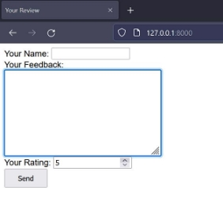

But as you see we copy over and over again and this is not good so we can do this with for loop like this: 

<form method="post"> 

`    ` 

`    ` 

`        `
     {{ field.label\_tag }}  

`    `{{ field }} 

`    `{{ field.errors }} 

`        `
 

`    ` 

`    `<button type="submit">Send</button> 

</form>

60 

So now this is the output: 

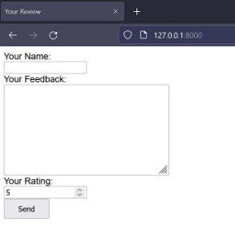

And if we input some data this is the log: 

[19/Jun/2022 19:50:59] "GET / HTTP/1.1" 200 1009 

{'user\_name': 'test', 'review\_text': 'hello this is a test', 'rating': 3} 

**o14** 

now we want store the data in database not just print it, for this we need to create a tabel with models.py like this: \feedback\reviews\models.py 

class Review(models.Model): 

`    `user\_name = models.CharField(max\_length=20)     review\_text = models.TextField() 

`    `rating = models.IntegerField() 

now we need to make migrations 

python .\manage.py makemigrations python .\manage.py migrate    

now for saving data we nned something in views.py file \feedback\reviews\views.py 

from .models import Review 

def review(request): 

`    `if request.method == "POST": 

`        `form = ReviewForm(request.POST) 

`        `if form.is\_valid(): 

`            `review\_get = Review(user\_name=form.cleaned\_data['user\_name'],                             review\_text=form.cleaned\_data['review\_text'], 

`                         `rating=form.cleaned\_data['rating']) 

`            `review\_get.save() 

`            `return HttpResponseRedirect("/thank\_you") 

At first we need import our models then we sve it like this. 

Modelsfield = from.cleaned\_data[‘here\_put\_the\_name\_of\_form\_field’] Then we need save the database now lets test it: 

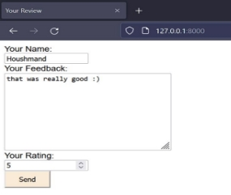

62 
**o15** 

we have another way to create a from in this way we create it by models. This is like in admin panel and django create it automatically \feedback\reviews\forms.py 

from .models import Review 

class ReviewForm(forms.ModelForm):     class Meta: 

`        `model = Review 

`        `fields = '\_\_all\_\_' 

like this we create it auto by django in fields we select which field shows up. Also, we can create a list of fields for this if we want fields = ['user\_name', 'review\_text', 'rating'] 

also we can exclude fields like this: 

exclude = ['something'] 

then django create it like this: 

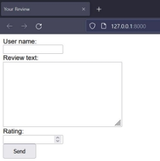

But as you see the label are gone because it’s made by django but like before we can edit it. 

**o16** 

for customization we have some kay like error\_messages and labels like this: 

class ReviewForm(forms.ModelForm): 

`    `class Meta: 

... 

`        `labels = { 

`            `"user\_name": "Your Name", 

`            `"review\_text": "Your Feedback", 

`            `"rating": "Your Rating" 

`        `} 

“Name of field”:” label”** 

And for error messages: 

class ReviewForm(forms.ModelForm): 

`    `class Meta: 

... 

`        `error\_messages = { 

`            `"user\_name": { 

`                `"required": "Your name must not be empty",                 "max\_length": "please enter a shorter name!"             } 

`        `} 

error\_messages= { 

“Which\_field”: { 

“Some\_error”: “text of error” 

} 

} 

Output: 

63 

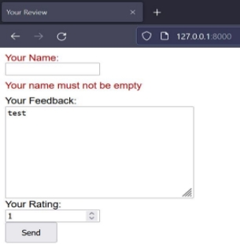

**o17** 

when we use model forms, we can save data with other way we can just called form.save() \feedback\reviews\views.py 

def review(request): 

`    `if request.method == "POST": 

`        `form = ReviewForm(request.POST) 

`        `if form.is\_valid(): 

`            `form.save() 

with this way also we can update a review if we need. If you want, you can do like this: 

def review(request): 

`    `if request.method == "POST": 

`        `existing\_model = Review.objects.get(pk=1) 

`        `form = ReviewForm(request.POST, instance=existing\_model)         if form.is\_valid(): 

`            `form.save() 

with this we can update a field. But we don’t need it for now, so I deleted now lets test it: 

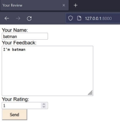

**o18** 

as you see in views.py file for ‘get’ and ‘post’ we have different commands and we use if to separate them from each other. but we have another way, the class based views we have a lots of class baesd views but for now we use one of them.(in next section we learn more about it). 

At first, we need import view from Django.view (for now, because we have lots of class based view). 

from django.views import View 

then we create class for this view and create get function and post function like this: 

65 

class ReviewView(View): 

`    `def get(self, request): 

... 

`    `def post(self, request): 

... 

Now for each requests we can add some code like simple view 

class ReviewView(View): 

`    `def get(self, request): 

`        `form = ReviewForm() 

`        `return render(request, "reviews/reviews.html", {             "form": form 

`        `}) 

`    `def post(self, request): 

`        `form = ReviewForm(request.POST) 

`        `if form.is\_valid(): 

`            `form.save() 

`            `return HttpResponseRedirect("/thank\_you") 

`        `return render(request, "reviews/reviews.html", {             "form": form 

`        `}) 

but with class based view we need change something in URLs \feedback\reviews\urls.py 

urlpatterns = [ 

`    `path("", views.ReviewView.as\_view()), ] 

for classed baesd view : path(“url”, views.NameOfViews.as\_view()) 

now if we run it its like before. But why we do this? 

Because now it's a little clearer but class based views has another ability for now we just test it and in next part we learned more about it.**  

https://github.com/houshmand-2005/hash\_neco/tree/Forms\_10 

**11** 

**CLASS VIEWS  **

**oo2** 

Ok for start lets create a base.html file like before, why? Because later we add more html file. \feedback\templates\reviews\base.html 

 

<!DOCTYPE html> 

<html lang="en"> 

<head> 

`    `<meta charset="UTF-8"> 

`    `<title></title> 

`    `<link rel="stylesheet" href=""> </head> 

<body> 

 

 

</body> 

</html> 

Then in review html file and thank you page let’s use this. \feedback\templates\reviews\reviews.html

 

Your review 

 

<form method="post"> 

`    ` 

`    ` 

`        `
     {{ field.label\_tag }}  

`    `{{ field }} 

`    `{{ field.errors }} 

`        `
 

`    ` 

`    `<button type="submit">Send</button> 

</form> 

 

\feedback\templates\reviews\thank\_you.html

 

thank you  

<h1>Thank you!</h1> 

 

now we can add a page for shows all of reviews in database and more with class views. 

**oo3** 

now before the reviews project lets change thank \_you view to class base view (there is no problem with before just for learn class views). \feedback\reviews\views.py 

class ThankYou(View): 

`    `def get(self, request): 

`        `return render(request, "reviews/thank\_you.html") 

and also, for URL: 

\feedback\reviews\urls.py

urlpatterns = [ 

`    `path("", views.ReviewView.as\_view()), 

`    `path("thank\_you", views.ThankYou.as\_view()) ]

as you know we don’t need post request function for this, so for sometimes we don’t need post we can use a built-in method called Template View, this class view is specific for when we just have ‘get’ and no post like the thank you page as you see. 

At first, we need to import it \feedback\reviews\views.py 

from django.views.generic import TemplateView then  

class ThankYou(TemplateView): 

`    `template\_name = "reviews/thank\_you.html" 

as you see in template\_name we say where the template is. 

Now if we want to add some context like before we need do this: 

class ThankYou(TemplateView): 

`    `template\_name = "reviews/thank\_you.html" 

`    `def get\_context\_data(self, \*\*kwargs): 

`        `context = super().get\_context\_data(\*\*kwargs)         context["message"] = "This works!" 

`        `return context 

and in thank you page \feedback\templates\reviews\thank\_you.html

 <h1>Thank you!</h1> <h3>{{ message }}</h3>  

Output: 

**oo4** 

now let’s create a list of all reviews 

at first create a html file for this. \feedback\templates\reviews\review\_list.html Then let’s create a view 

\feedback\reviews\views.py 

from .models import Review 

class ReviewList(TemplateView): 

`    `template\_name = "reviews/review\_list.html" 

`    `def get\_context\_data(self, \*\*kwargs): 

`        `reviews = Review.objects.all() 

`        `context = super().get\_context\_data(\*\*kwargs)         context["reviews"] = reviews 

`        `return context 

like this we get all of reviews from database in context. For show this data we can do this: \feedback\templates\reviews\review\_list.html 

 

Reviews list 



<ul>

 

`    `<li> 

`    `
{{ review.user\_name }}  (Rating : {{ review.rating }})
     </li> 



</ul> 



Now we need add a URL for this view \feedback\reviews\urls.py

urlpatterns = [ 

`    `... 

`    `path("reviews", views.ReviewList.as\_view()) ] 

Output: 

**oo5** 

Now for these reviews lets create a detail page to show more about review. At first let’s create a html for this page \feedback\templates\reviews\detail\_review.html

Then view 

\feedback\reviews\views.py 

class DetailReview(TemplateView): 

`    `template\_name = "reviews/detail\_review.html" 

`    `def get\_context\_data(self, \*\*kwargs): 

`        `context = super().get\_context\_data(\*\*kwargs) 

`        `reviews = Review.objects.get(pk=kwargs["ReviewId"])         context["selected\_review"] = reviews 

`        `return context 

we get id of reviews with kwargs[“field\_in\_URL”] then we query with this id. \feedback\reviews\urls.py

urlpatterns = [ 

`    `... 

`    `path("reviews/<int:ReviewId>", views.DetailReview.as\_view(),          name="reviews\_page") 

] 

and in html file \feedback\templates\reviews\detail\_review.html 

 

 

 

`        `<h2>{{ selected\_review.user\_name }}</h2> 

`        `
rating : {{ selected\_review.rating }}
         
{{ selected\_review.review\_text }}
 

 

Now for add a link in list to go on detail page. \feedback\templates\reviews\review\_list.html 

 

`    `<li> 

`        `<a href=""> 

`            `
{{ review.user\_name }}  (Rating : {{ review.rating }})
         </a> 

`    `</li> 

 

Output: 

 

**oo6** 

As you see in ReviewList view we render a list of fields from database so django has a built-in tool for that. For using this tool, we need import it 

\feedback\reviews\views.py 

from django.views.generic import ListView 

then let’s change the view 

class ReviewList(ListView): 

`    `template\_name = "reviews/review\_list.html"     model = Review 

as you see we have a new variable called model in this var we input the model we want to use it. Now we are done let’s test it. 

But as you see we don’t get anything why? Because in for loop we don’t have a reviews variable we need to change this to object\_list \feedback\templates\reviews\review\_list.html 

 ... 

 

Now its working. But this name is not very good so we can change it by add context\_object\_name. \feedback\reviews\views.py 

class ReviewList(ListView): 

`    `... 

`    `context\_object\_name = "reviews" 

and now we can change the object\_list to reviews \feedback\templates\reviews\review\_list.html 

 ... 

 

Now its work. 

But if we want to show reviews with rating higher than 3 for this, we can do this: \feedback\reviews\views.py 

class ReviewList(ListView): 

`    `template\_name = "reviews/review\_list.html"     model = Review 

`    `context\_object\_name = "reviews" 

`    `def get\_queryset(self): 

`        `base\_query = super().get\_queryset() 

`        `data = base\_query.filter(rating\_\_gt=3)         return data 

with this way we can query some data form database. Output: 

But a want to show all the review so I comment this part. 

**oo7** 

now if you remember the detail review view, we can do something else for that. We have a detailview for get one item so, at first, we need import it 

from django.views.generic import DetailView 

then for view we can do this 

class DetailReview(DetailView): 

`    `template\_name = "reviews/detail\_review.html"     model = Review 

then django automatically do this for us (it’s very easy) but in URL we need change something. \feedback\reviews\urls.py

urlpatterns = [ 

`    `... 

`    `path("reviews/<int:pk>", views.DetailReview.as\_view(), name="reviews\_page") ] 

As you see we need change the Dynamic Segments (<int:here>) to pk. then django can find it. but how django find out our name in template? 

Django find it by lower case of model name or if we change it to object. 

So, we change the name to review \feedback\templates\reviews\detail\_review.html 

 

`        `<h2>{{ review.user\_name }}</h2> 

`        `
rating : {{ review.rating }}
         
{{ review.review\_text }}
 

 

Now its works like before. **oo9** 

ok as you see before we have a lot of class view and so also, we have a view for forms. So, at first like before we need import it 

\feedback\reviews\views.py 

from django.views.generic.edit import FormView now let’s change the view 

class ReviewView(FormView): 

`    `form\_class = ReviewForm 

`    `template\_name = "reviews/reviews.html" 

as you see we have a new variable named form\_class we must input this field with our form. For now, we handle the get request. 

Now if user for example input an invalid data django can handle that but if this valid we have error because django doesn’t know what it can do after this. So, we add another field for that 

class ReviewView(FormView): 

`    `... 

`    `success\_url = "/thank\_you" 

now if user input a valid data django redirect user to thank you page 

but if we go in review list page, we can’t see it because django doesn’t save it. Now for save the data we can do this: 

class ReviewView(FormView): 

`    `form\_class = ReviewForm 

`    `template\_name = "reviews/reviews.html"     success\_url = "/thank\_you" 

`    `def form\_valid(self, form): 

`        `form.save() 

`        `return super().form\_valid(form) 

and now its works like before. 

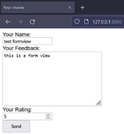 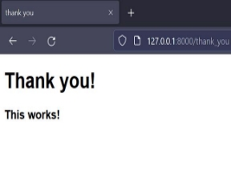 

**o10** 

Also, we have another thing for form, named create form 

from django.views.generic.edit import CreateView 

and then 

class ReviewView(CreateView):     model = Review 

`    `fields = '\_\_all\_\_' 

as you see we don’t even need form because django can created. But here we can’t do customizations like label or error messages so, like before we can still use the form\_class = ReviewForm 

class ReviewView(CreateView): 

`    `model = Review 

`    `form\_class = ReviewForm 

`    `template\_name = "reviews/reviews.html"     success\_url = "/thank\_you" 

with this way now django save the data for us too. Also, we have update view and delete view they also work like create view. 

https://github.com/houshmand-2005/hash\_neco/tree/Class\_Views\_11 

**12** 

**FILE UPLOADS **

For start this part I create the basic files (some html and set a simple URL and view for show html file just this) you can download it from here: https://github.com/academind/django-practical-guide-course-code/archive/refs/heads/file-upload-00-starting-setup.zip 

So, for upload input in html file, we need change some attributes 

**oo3** 

\feedback\profiles\templates\profiles\create\_profile.html 

<body> 

`  `<form action="/profiles/" method="post" enctype="multipart/form-data">      

`      `<input type="file" name="image"/> 

`    `<button>Upload!</button> 

`  `</form> 

</body> 

We set the action for set it to our URL and we also set method to post because we want to post some data like photo and the enctype, this value is necessary if the user will upload a file through the form.so now we are good in html lets add some more code to view \feedback\profiles\views.py 

from django.http import HttpResponseRedirect 

class CreateProfileView(View): 

`    `def get(self, request): 

`        `return render(request, "profiles/create\_profile.html")     def post(self, request): 

`        `print(request.FILES["image"]) 

`        `return HttpResponseRedirect("/profiles") 

as you see we get file by request.FILES[“the name of input so for now is image”] now let’s test it 

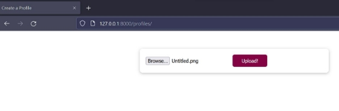

And in terminal: 

Untitled.png 

As you see we get the file, but we don’t save it we just print name of the file. 

**oo4** 

So, for store the file we can use lots of way but for now I code some basics to understand how it works. For save it we can use python commands like with open, so for doing this I create a function. 

def store\_file(file): 

`    `with open("temp/image.png", "wb+") as dest: 

`        `for chunk in file.chunks(): 

`            `dest.write(chunk) 

I open a image.png with wb+ (this can help us with open binary file like images and then we can write to that file) then for each chunk of photo I write it to file and then file created. 

So now we can use this function 

class CreateProfileView(View): 

`    `... 

`    `def post(self, request): 

`        `store\_file(request.FILES["image"]) 

And then for save the photo we need create the directory called temp in main folder \feedback\temp 

Output:

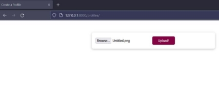

\feedback\temp 

Mode                 LastWriteTime         Length Name ----                 -------------         ------ ---- -a----         6/25/2022   7:33 PM         185752 image.png so, as you see we can store the file but just with .PNG format 

**oo5** 

now we can use form for load input tag automated. So, let’s create from.py file for that. \feedback\profiles\form.py 

from django import forms 

class ProfileForm(forms.Form): 

`    `user\_image = forms.FileField() 

now we can use this to our template \feedback\profiles\templates\profiles\create\_profile.html 

<body> 

`  `<form action="/profiles/" method="post" enctype="multipart/form-data">      

`      `{{ form }} 

`    `<button>Upload!</button> 

`  `</form> 

</body> 

Now also we need change some code in view \feedback\profiles\views.py 

from .form import ProfileForm 

class CreateProfileView(View): 

`    `def get(self, request): 

`        `form = ProfileForm 

`        `return render(request, "profiles/create\_profile.html",  {             "form": form 

`        `}) 

`    `def post(self, request): 

`        `submitted\_form = ProfileForm(request.POST, request.FILES)         if submitted\_form.is\_valid(): 

`            `store\_file(request.FILES["user\_image"]) 

`            `return HttpResponseRedirect("/profiles") 

`        `return render(request, "profiles/create\_profile.html", {             "form": submitted\_form 

`        `}) 

now because we use form.py error handled automatically. And now it looks like before. 

**oo6** 

also, we can use models to save our files \feedback\profiles\models.py 

class UserProfile(models.Model): 

`    `image = models.FileField(upload\_to="images") 

the upload\_to field tells django were save the files because files doesn’t store in database just path of files store in database (also, we need to do migrations.) 

Ok for now django save files in base directory of project but if we want change path to uploads folder, we can do this in setting.py 

\feedback\feedback\settings.py 

MEDIA\_ROOT = BASE\_DIR / "uploads" 

So now in view we can use this model \feedback\profiles\views.py

from .models import UserProfile 

class CreateProfileView(View): 

`    `def get(self, request): 

`        `... 

`    `def post(self, request): 

`        `submitted\_form = ProfileForm(request.POST, request.FILES) 

`        `if submitted\_form.is\_valid(): 

`            `profile = UserProfile(image=request.FILES["user\_image"])             profile.save() 

- store\_file(request.FILES["user\_image"]) 

`    `... 

Now also we don’t need our function because django automatically save it. 

- def store\_file(file): 
- with open("temp/image.png", "wb+") as dest: 
- for chunk in file.chunks(): 
- dest.write(chunk) 

So, I commit it. 

Now if we upload some file, this is how it looks like. ├───uploads 

│   └───images 

│           MRH.png 

And in database 

**oo7** 

now also we have a field just for images with this field user just can upload the images, so we have built in validation. \feedback\profiles\models.py 

class UserProfile(models.Model): 

`    `image = models.ImageField(upload\_to="images") 

and we need change the form filed \feedback\profiles\form.py 

class ProfileForm(forms.Form): 

`    `user\_image = forms.ImageField() 

but when we run server, we get an error. 

ERRORS: 

profiles.UserProfile.image: (fields.E210) Cannot use ImageField because Pillow is not installed. 

HINT: Get Pillow at https://pypi.org/project/Pillow/ or run command "python -m pip install Pillow". 

As you see, Django says, for the image field it needs an external library called pillow, so we need to install it. 

pip install pillow 

Now it works fine and if a user uploads a file (not a photo) he gets this error: 

**oo8** 

however, we have a special view for this job 

\feedback\profiles\views.py

from .models import UserProfile 

from django.views.generic.edit import CreateView class CreateProfileView(CreateView): 

`    `template\_name = "profiles/create\_profile.html"     model = UserProfile 

`    `fields = "\_\_all\_\_" 

`    `success\_url = "/profiles" 

this view work likes other class views. With this view we can delete our long old view. **oo9** 

so now if we want to see the photos, we can do this: 

let’s create a view  

from django.views.generic import ListView 

class UserProfiles(ListView): 

`    `model = UserProfile 

`    `template\_name = "profiles/user\_profiles.html"     context\_object\_name = "profiles" 

as you see we use list view because we want to return a list of photos to user. So now for template we use ‘for’ like this (profile.filed\_name\_in\_database.url). \feedback\profiles\templates\profiles\user\_profiles.html 

<body> 

<ul> 

`    ` 

`    `<li> 

`        `     </li> 

`    ` 

</ul> 

</body> 

And at lest we need set the URL \feedback\profiles\urls.py

urlpatterns = [ 

`    `path("", views.CreateProfileView.as\_view()),     path("all/", views.UserProfiles.as\_view()) ] 

Output:** 

**Html:** <li> 

 

</li> 

As you see we get the URL but when we want to open it, we get 404 error. 

**o10** 

django automatically lock all the folder because of security reasons. So, we need say to django these files are ok to showing up. \feedback\feedback\settings.py 

MEDIA\_URL = "/user-uploads/" 

Now the images URL start with this  

\feedback\feedback\urls.py 

from django.conf.urls.static import static 

from django.conf import settings 

urlpatterns = [ 

... 

] + static(settings.MEDIA\_URL, document\_root=settings.MEDIA\_ROOT) 

At first, we need import setting and static  

Then we called static, and we input these parameters. static (“URL of MEDIA”, “path of MEDIA”) 

now we can see our uploads 

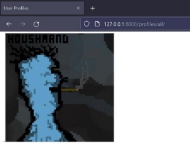

URL of this photo http://127.0.0.1:8000/user-uploads/images/MRH.png 

https://github.com/houshmand-2005/hash\_neco/tree/File\_Uploads\_12 

80 
81** 

**SESSIONS **

The sessions are between client and server and, session framework lets us to store and retrieve arbitrary data on a per-site-visitor basis. For more information you can see this: **003 What are Sessions** 

**oo4****                                                                                                                                         

at first, we need take look to our project to see are we install sessions (by default its install)** 

\feedback\feedback\settings.py 

INSTALLED\_APPS = [ 

`    `... 

`    `'django.contrib.sessions', 

] 

MIDDLEWARE = [ 

`    `... 

`    `'django.contrib.sessions.middleware.SessionMiddleware', ] 

Also, we can set how long a session must be alive by this command SESSION\_COOKIE\_AGE = 120 

By default, its two weeks, so I don’t want to change it, so I delete it. **oo5** 

so, for test sessions I want add a button for each review to user set it to his or her favorite review so for this I add a Butten \feedback\templates\reviews\detail\_review.html 

<form action="/reviews/favorite" method="POST"> 

`    ` 

`    `<input type="hidden" name="review\_id" value="{{ review.id }}">     <button>Favorite</button> 

</form> 

I add a hidden input to django knows which reviews it’s my favorite. So now also we need URL for this 

\feedback\reviews\urls.py

urlpatterns = [ 

`    `... 

`    `path("reviews/favorite", views.AddFavoriteView.as\_view()),     path("reviews/<int:pk>", views.DetailReview.as\_view()) 

]

As you see we most set URL before the detail review. And for view: 

\feedback\reviews\views.py 

from .models import Review 

class AddFavoriteView(View): 

`    `def post(self, request): 

`        `review\_id = request.POST["review\_id"] 

as you see we get the detail of favorite review but how we can store in session. 

**oo6 and oo7** 

class AddFavoriteView(View): 

`        `... 

`        `request.session["favorite\_review"] = review\_id 

`        `return HttpResponseRedirect("/reviews/" + review\_id)

Now we set the session with the favorite review then we redirect user to selected favorite review. **oo8 and oo9** 

now we want if user click on favorite show some text and hide the button. 

class DetailReview(DetailView): 

`    `template\_name = "reviews/detail\_review.html" 

`    `model = Review 

81 

`    `def get\_context\_data(self, \*\*kwargs): 

`        `context = super().get\_context\_data(\*\*kwargs) 

`        `loaded\_review = self.object 

`        `request = self.request 

`        `favorite\_id = request.session.get("favorite\_review") 

`        `context["is\_favorite"] = favorite\_id == str(loaded\_review.id)         return context 

As you see we get information of use visit page with self.object then we get the request user sent and with that we can get the session now if user clicked on the button we have a key here and then if the kay we get from session is equal to key of page user see we pass true.  So now in html file we can handle it. 

 

`  `
This is my favorite!
 

 

`  `<form action="/reviews/favorite" method="POST"> 

`    ` 

`    `<input type="hidden" name="review\_id" value="{{ review.id }}"> 

`    `<button>Favorite</button> 

`  `</form> 

 

Now let’s test it 

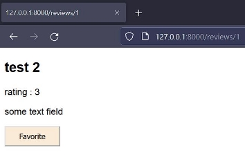 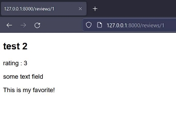

Other pages: 

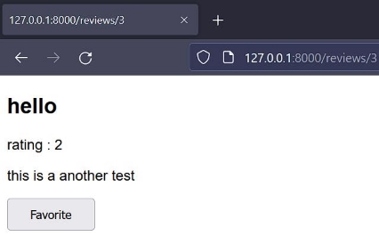

https://github.com/houshmand-2005/hash\_neco/tree/Sessions\_13 

83 
84** 

**IMPORTANT NOTES  **

So, you finished the book, what can you do next? 

You can learn more and dipper with documents and these 2 parts of django course by mosh https://codewithmosh.com/p/the-ultimate-django-part2 https://codewithmosh.com/p/the-ultimate-django-part3 

if you want to know about deploy you can see S15\_Deployment. 

also, you can learn DRF (django rest framework) and learn about docker because if you want to deploy your project its very useful. 

Also, you can learn about Linux and Fast API. 

This book is just a booklet of django not a full book so there may be problems. I write this book because I want to learn deeper and when I forget a part of django I look to this book and then I can remember it. 

I'm not English, so there may be a lot of grammar and spelling problems, so if you can help me with this go to my GitHub. 

My GitHub ID: https://github.com/houshmand-2005/  

My Telegram ID: https://t.me/Houshmand\_Am 

By: Amir Mohammad Houshmand 

**From Apr 23, 2022, to June 27, 2022** 

84 

Django makes it easier to build better web apps more quickly and with less code.

WHY DJANGO? 

With Django, you can take web applications from concept to launch in a matter of hours. Django takes care of much of the hassle of web development, so you can focus on writing your app without needing to reinvent the wheel. It’s free and open source. 

**If you want to learn django you can start with this book** 

Amir Mohammad Houshmand 
86 
